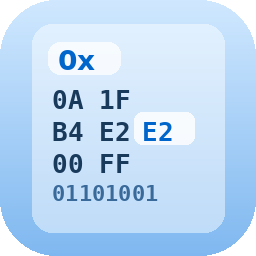

# Hex Editor

A lightweight native hex editor built with GTK4 and libadwaita.



## Features

- **Hex and Binary view** — switch with Ctrl+B
- **Edit** hex bytes, binary bits, or ASCII text directly
- **Cross-highlight** — cursor position shown in both hex/bin and ASCII panes with distinct colors
- **Search** — find hex patterns (`FF D8 FF`) or ASCII text
- **Go to offset** — jump to any position (hex or decimal)
- **13 themes** — System, Light, Dark, Solarized, Monokai, Gruvbox, Nord, Dracula, Tokyo Night, Catppuccin
- **Modified bytes** highlighted in red
- **Auto-growing buffer** — create new files from scratch
- **Save protection** — prompts before closing with unsaved changes
- **Persistent settings** — font, theme, layout preferences remembered

## Build

Requirements: `gcc`, `pkg-config`, `libadwaita-1-dev`, `libgtk-4-dev`

```bash
sudo apt install libadwaita-1-dev libgtk-4-dev
make
```

## Run

```bash
./build/hex-editor
```

## Install Desktop Shortcut

```bash
cp ~/.local/share/applications/hex-editor.desktop ~/.local/share/applications/
update-desktop-database ~/.local/share/applications/
```

## Keyboard Shortcuts

| Shortcut | Action |
|---|---|
| Ctrl+N | New file |
| Ctrl+O | Open file |
| Ctrl+S | Save |
| Ctrl+Shift+S | Save as |
| Ctrl+F | Find |
| Ctrl+G | Go to offset |
| Ctrl+B | Toggle hex/binary |
| Ctrl+Plus/Minus | Zoom in/out |
| Ctrl+Q | Quit |
| Tab | Switch hex/ASCII pane |
| Shift+Arrows | Select bytes |

## Configuration

Settings are stored in `~/.config/hex-editor/settings.conf`.

## Documentation

- [Architecture](docs/architecture.md)
- [Changelog](docs/changelog.md)

## License

MIT
